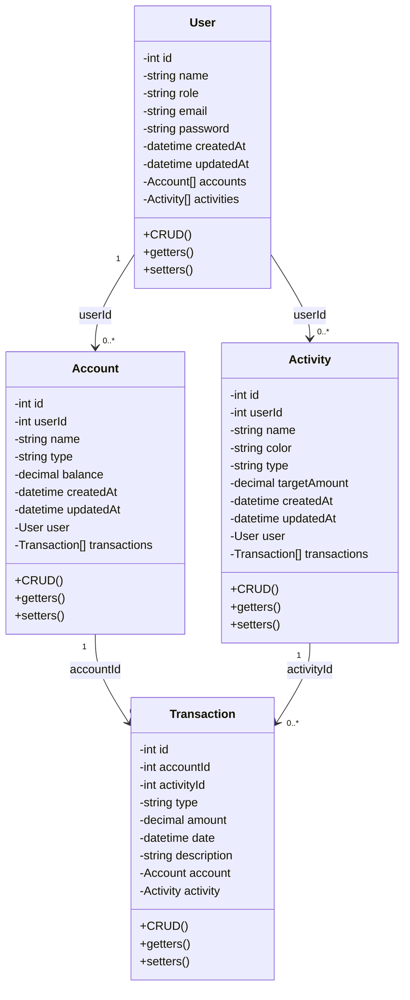

# Modelo de Dominio — FinZen

> Fuente de verdad: diagrama de clases oficial del proyecto.

El sistema contiene exactamente cuatro clases: `User`, `Account`, `Activity` y `Transaction`.
Para soportar persistencia plana (ej. `localStorage`) y evitar referencias circulares, el modelo implementa **llaves foráneas** (`userId`, `accountId`, `activityId`).

## Diagrama oficial

## Atributos

### User
`id: int`, `name: string`, `role: string`, `email: string`, `password: string`, `createdAt: datetime`, `updatedAt: datetime`, `accounts: Account[]`, `activities: Activity[]`.

### Account
`id: int`, `userId: int`, `name: string`, `type: string`, `balance: decimal`, `createdAt: datetime`, `updatedAt: datetime`, `user: User`, `transactions: Transaction[]`.

### Activity
`id: int`, `userId: int`, `name: string`, `color: string`, `type: string`, `targetAmount: decimal`, `createdAt: datetime`, `updatedAt: datetime`, `user: User`, `transactions: Transaction[]`.

### Transaction
`id: int`, `accountId: int`, `activityId: int`, `type: string`, `amount: decimal`, `date: datetime`, `description: string`, `account: Account`, `activity: Activity`.

## Relaciones

- `User 1 : 0..* Account` (vía `userId`)
- `User 1 : 0..* Activity` (vía `userId`)
- `Account 1 : 0..* Transaction` (vía `accountId`)
- `Activity 1 : 0..* Transaction` (vía `activityId`)

**No existe una relación directa `User → Transaction`.**

Tampoco contiene `accountNumber`, `bank` o `initialBalance` en `Account`, `active` en `User`, ni `updatedAt` en `Transaction`.

En TypeScript, `decimal` se representa normalmente como `number`.

## Regla de consistencia

Cualquier interfaz, DTO, store, seeder, service o vista que contradiga esta definición está desactualizada. Un cambio al modelo debe hacerse primero en el diagrama/documentación y luego propagarse al código.
