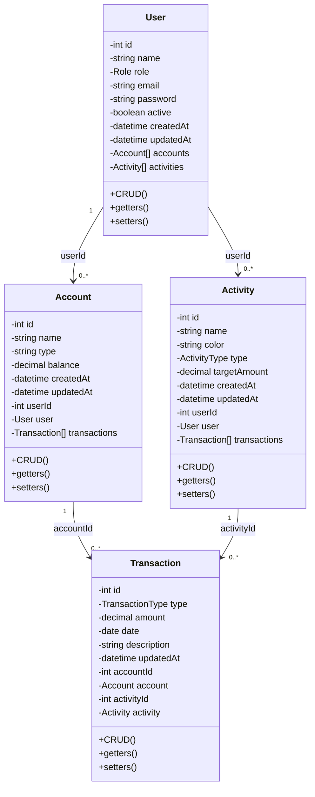

# Modelo de Dominio — FinZen

> Fuente de verdad: diagrama de clases oficial del proyecto
> (`docs/architecture/deliverable-2/class-diagram.drawio`), implementado por las entidades de
> TypeORM en `backend/src/*/entities/`.

El sistema contiene exactamente cuatro clases: `User`, `Account`, `Activity` y `Transaction`.
Cada relación es una **llave foránea** (`userId`, `accountId`, `activityId`) con
`ON DELETE CASCADE` en la base de datos SQLite.

## Diagrama oficial

```mermaid
classDiagram
    class User {
        -int id
        -string name
        -Role role
        -string email
        -string password
        -boolean active
        -datetime createdAt
        -datetime updatedAt
        -Account[] accounts
        -Activity[] activities
        +CRUD()
        +getters()
        +setters()
    }

    class Account {
        -int id
        -string name
        -string type
        -decimal balance
        -datetime createdAt
        -datetime updatedAt
        -int userId
        -User user
        -Transaction[] transactions
        +CRUD()
        +getters()
        +setters()
    }

    class Activity {
        -int id
        -string name
        -string color
        -ActivityType type
        -decimal targetAmount
        -datetime createdAt
        -datetime updatedAt
        -int userId
        -User user
        -Transaction[] transactions
        +CRUD()
        +getters()
        +setters()
    }

    class Transaction {
        -int id
        -TransactionType type
        -decimal amount
        -date date
        -string description
        -datetime updatedAt
        -int accountId
        -Account account
        -int activityId
        -Activity activity
        +CRUD()
        +getters()
        +setters()
    }

    User "1" --> "0..*" Account : userId
    User "1" --> "0..*" Activity : userId
    Account "1" --> "0..*" Transaction : accountId
    Activity "1" --> "0..*" Transaction : activityId
```

## Atributos

### User
`id: int`, `name: string`, `role: Role` (`admin` | `user`), `email: string`, `password: string`
(hash scrypt, `select: false`), `active: boolean`, `createdAt: datetime`, `updatedAt: datetime`,
`accounts: Account[]`, `activities: Activity[]`.

### Account
`id: int`, `name: string`, `type: string`, `balance: decimal`, `createdAt: datetime`,
`updatedAt: datetime`, `userId: int`, `user: User`, `transactions: Transaction[]`.

### Activity
`id: int`, `name: string`, `color: string`, `type: ActivityType` (`expense` | `savings`),
`targetAmount: decimal`, `createdAt: datetime`, `updatedAt: datetime`, `userId: int`, `user: User`,
`transactions: Transaction[]`.

### Transaction
`id: int`, `type: TransactionType` (`income` | `expense`), `amount: decimal`, `date: date`,
`description: string`, `updatedAt: datetime`, `accountId: int`, `account: Account`,
`activityId: int`, `activity: Activity`.

`Transaction` no tiene `createdAt`: `date` es el momento en que ocurrió el movimiento y lo reemplaza.

## Relaciones

- `User 1 : 0..* Account` (vía `userId`)
- `User 1 : 0..* Activity` (vía `userId`)
- `Account 1 : 0..* Transaction` (vía `accountId`)
- `Activity 1 : 0..* Transaction` (vía `activityId`)

**No existe una relación directa `User → Transaction`**: el dueño de una transacción es el dueño
de su cuenta.

`Account` tampoco contiene `accountNumber`, `bank` ni `initialBalance`.

En TypeScript, `decimal` se representa como `number`.

## Regla de consistencia

Cualquier entidad, migración, interfaz, DTO, service o vista que contradiga esta definición está
desactualizada. Un cambio al modelo debe hacerse primero en el diagrama/documentación y luego
propagarse al código (entidad + migración en el backend, interfaz y DTOs en el frontend).
