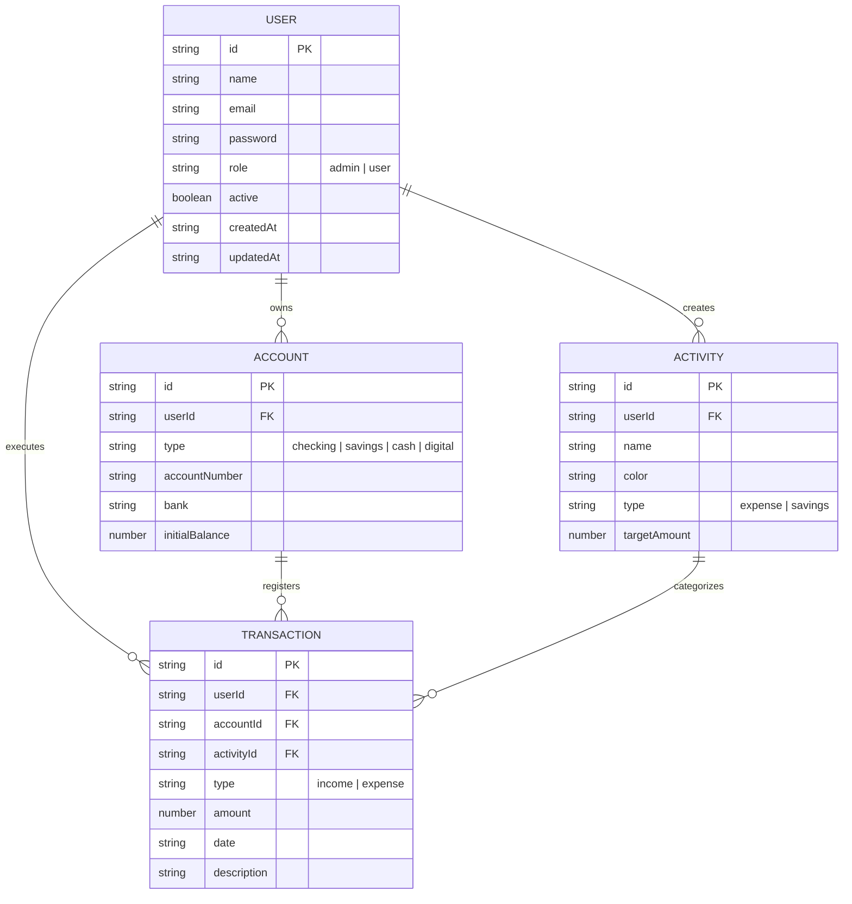

# Deliverable 1 — Base Architecture & Scope

This document details the core foundation for Deliverable 1 of the **FinZen** Personal Expense Tracker.

---

## 1. Domain Model (Entities & Relationships)

The system is modeled around **four core domain entities**:



### Entity Contracts

1. **User**: Represents authentication, identity, and role-based permissions (`admin` vs `user`).
2. **Account**: Financial buckets (Bank accounts, Cash wallets, Digital wallets) with an `initialBalance` and dynamically computed current balance.
3. **Activity**: Financial category / bucket with color tagging, type (`expense` or `savings`), and target budgeting amounts.
4. **Transaction**: Individual financial movement linking an account and an activity with a signed amount, date, and description.

---

## 2. Application Scope & Pages Catalogue

The application features **9 structured routes / views**:

| # | Route | View Component | Access Role | Description |
|---|---|---|---|---|
| 1 | `/login` | `LoginView.vue` | Public | Authentication with email & password |
| 2 | `/` | `DashboardView.vue` | User / Admin | Overview: net balance, metric cards, 6-month trend chart, recent movements |
| 3 | `/transactions` | `TransactionsView.vue` | User / Admin | Transactions table with combined filtering (type, account, month) and actions |
| 4 | `/transactions/new` | `TransactionFormView.vue` | User / Admin | Form to record new transactions |
| 5 | `/transactions/:id/edit` | `TransactionFormView.vue` | User / Admin | Form to modify existing transactions |
| 6 | `/accounts` | `AccountsView.vue` | User / Admin | Accounts summary with real-time balance calculations |
| 7 | `/accounts/new` | `AccountFormView.vue` | User / Admin | Form to create a new financial account |
| 8 | `/reports` | `ReportsView.vue` | User / Admin | Interactive Chart.js analytics by category, trend, and period |
| 9 | `/activities` | `ActivitiesView.vue` | **Admin Only** | Administrative CRUD for expense/savings categories |
| 10 | `/users` | `UsersView.vue` | **Admin Only** | Administrative user directory, role switcher, and activation toggle |

---

## 3. Layered Architecture (`View → Service → Store`)

FinZen is built as a **Single Page Application (SPA)** with **Client-Side Rendering (CSR)** following strict layer separation:

```
┌────────────────────────────────────────────────────────┐
│                        VIEW                            │
│  (UI composition, local presentation state, templates) │
└──────────────────────────┬─────────────────────────────┘
                           │ calls static methods
                           ▼
┌────────────────────────────────────────────────────────┐
│                       SERVICE                          │
│  (Business logic, domain validations, sanitization)    │
└──────────────────────────┬─────────────────────────────┘
                           │ reads / updates
                           ▼
┌────────────────────────────────────────────────────────┐
│                        STORE                           │
│  (Pinia reactive state, no business logic)             │
└──────────────────────────┬─────────────────────────────┘
                           │ watches & syncs
                           ▼
┌────────────────────────────────────────────────────────┐
│                    LOCALSTORAGE                        │
│  (Client-side browser persistence & seeders bootstrap) │
└────────────────────────────────────────────────────────┘
```

### Persistence and Seeders Flow
1. On application startup, `PiniaConfig` checks if `localStorage` contains state.
2. **If empty**: It loads pre-configured `seeders` (`userseeder`, `accountseeder`, `activityseeder`, `transactionseeder`) with rich mock data.
3. **If populated**: It hydrates stores from `localStorage`.
4. State mutations in stores automatically sync back to `localStorage` via reactive watchers.

---

## 4. Reusable Components & Route Guards

### Reusable UI Components
- **`TablaGenerica.vue`**: Configurable table component accepting dynamic `columns` and `rows` props with `#actions` scoped slot. Reused in Transactions, Activities, and Users views.
- **`SelectorFiltro.vue`**: Generic dropdown/select filter with `v-model` support. Reused in Transactions and Reports.
- **`GraficoChart.vue`**: Chart.js wrapper handling canvas lifecycle and responsive re-rendering. Reused in Dashboard and Reports.
- **`StatCard.vue`**: Visual metric card for financial KPIs. Reused in Dashboard and Reports.

### Route Guards
- **Authentication Guard**: Unauthenticated users visiting private routes are intercepted and redirected to `/login`.
- **Role-Based Authorization Guard**: Non-admin users attempting to access `/activities` or `/users` are redirected to `/`.
